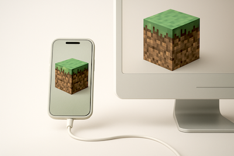

<div align="center">
  
</div>

## Minecraft Android Backup via USB

**Author:** Rich Lewis - [GitHub @RichLewis007](https://github.com/RichLewis007)

Easily backup your complete Minecraft Bedrock Edition worlds from your Android device to your computer via USB connection. This script uses ADB (Android Debug Bridge) to access protected app data directories and provides a user-friendly Text User Interface (TUI) for managing your Minecraft world backups. Worlds can be backed up as full folders or as .mcworld files.

## Overview

**Minecraft-Android-Backup-Via-USB** is a comprehensive backup solution for Minecraft Bedrock Edition worlds stored on Android devices. The script connects to your Android device over USB using ADB, discovers all your Minecraft worlds, and provides an intuitive menu system to backup individual worlds or all worlds at once. You can choose to backup worlds as full folders or as .mcworld files.

### Why This Tool Exists

Android's Scoped Storage system protects app data directories (including Minecraft worlds) from normal file access. You cannot simply browse to these folders using a file manager or MTP. ADB (Android Debug Bridge) provides the necessary system-level permissions to access these protected directories, making it the standard method for backing up app data.

**Key Benefits:**

- **Access Protected Data**: Bypasses Android Scoped Storage restrictions
- **Complete Backups**: Captures entire world directories including all chunks and metadata
- **Multiple Formats**: Choose between raw world folders or portable .mcworld files
- **User-Friendly**: Interactive menu system with searchable world lists
- **Organized**: Automatic timestamping and folder organization
- **Reliable**: Direct USB connection ensures fast, reliable data transfer

### What It Does

The script provides a menu-driven interface that allows you to:

1. **Discover Worlds**: Automatically finds all Minecraft worlds on your Android device
2. **Display Information**: Shows actual world names (not just folder IDs) and sorts by most recently played
3. **Selective Backups**: Choose individual worlds to backup or backup everything at once
4. **Format Choice**: Export as complete world folders or portable .mcworld files
5. **Manage Backups**: View backup location, clear cache, and organize your backups



## Features

- **Interactive menu system** - Supports fzf, gum, or basic select menu (auto-detects what's available)
- **Lists all Minecraft worlds** - Automatically discovers worlds from your Android device
- **Displays world names** - Shows actual world names from `levelname.txt` files (not just folder IDs)
- **Sorted by most recently accessed** - Worlds are automatically sorted by access date
- **Individual or bulk backup** - Backup one world at a time or all worlds at once
- **Two backup formats:**
  - **World folders**: Full directory structure with descriptive names (`<world-name>_<world-id>`)
  - **.mcworld files**: Zipped world archives ready for import into Minecraft
- **Automatic path detection** - Tries primary path, falls back to alternative automatically
- **Progress indicators** - Spinners show progress during long operations
- **Organized backup structure** - Timestamps and organized folders for easy management
- **Cache management** - Caches world list (expires after 5 minutes) with manual clear option
- **Finder integration** - Automatically opens backup location in Finder (macOS)

## Requirements

### macOS Dependencies

**Using Homebrew:**

```bash
# Install ADB (Android Debug Bridge) - required
brew install android-platform-tools

# Install zip (for .mcworld export) - required
brew install zip

# Optional: Enhanced menu experience
brew install fzf        # or
brew install gum
```

**Using MacPorts:**

```bash
# Install ADB (Android Debug Bridge) - required
sudo port install android-platform-tools

# Install zip (for .mcworld export) - required
sudo port install zip

# Optional: Enhanced menu experience
sudo port install fzf        # or
sudo port install gum
```

### Android Setup

1. **Enable USB Debugging**:

   - Settings → About Phone → Tap "Build Number" 7 times
   - Settings → Developer Options → Enable "USB Debugging"
   - Connect device via USB
   - Accept the debugging prompt on your phone when connected

2. **Verify ADB Connection**:
   ```bash
   adb devices
   # Should show your device with "device" status
   ```

## Installation

1. **Clone or download** this repository
2. **Make the script executable**:
   ```bash
   chmod +x minecraft-android-backup-via-usb.sh
   ```

## Usage

```bash
./minecraft-android-backup-via-usb.sh
```

The script will:

1. Check for ADB installation
2. Verify Android device connection
3. Display an interactive menu with options

## Menu Options

### List Minecraft Worlds

- Shows all Minecraft worlds from your device
- Worlds are sorted by most recently accessed
- Select a world to backup individually
- Choose backup format (world folder or .mcworld file)
- Returns to world list after backup to backup more

### Backup All Worlds

- Backs up all worlds at once
- Choose format (world folders or .mcworld files)
- Shows progress for each world

### Open Backup Folder

- Opens the backup directory in Finder (macOS)
- Shows backup location path on other systems

### Clear World List Cache

- Deletes the cached world list
- Shows cache file age and location
- Forces fresh fetch from device on next run

### Quit

- Exits the program

## Backup Directory Structure

Backups are saved to: `~/Downloads/Minecraft-Worlds-Backups/`

```
Minecraft-Worlds-Backups/
├── world-folders/
│   └── <world-name>__<timestamp>/
│       └── <world-name>__<world-id>/
│           └── (world files)
└── mcworld-files/
    └── <world-name>__<timestamp>/
        └── <world-name>.mcworld
```

**Example:**

```
Minecraft-Worlds-Backups/
├── world-folders/
│   └── My-World__2024-01-15__02-30-45-PM/
│       └── My-World__ABC123DEF/
│           ├── levelname.txt
│           ├── level.dat
│           └── ...
└── mcworld-files/
    └── My-World__2024-01-15__02-30-45-PM/
        └── My-World.mcworld
```

## How It Works

This section explains the technical implementation and workflow of the script.

### Connection Method: ADB Over USB

The script uses **ADB (Android Debug Bridge)** over a **USB cable connection** to access your Android device. Here's why this approach is necessary:

- **Android Scoped Storage**: Modern Android versions protect app data directories
- **Protected Path**: Minecraft worlds are stored in `/Android/data/` which requires special permissions
- **ADB Solution**: ADB provides system-level access that bypasses these restrictions
- **USB Connection**: Ensures reliable, high-speed data transfer for large world files
- **Standard Method**: This is the official and recommended way to access protected app data

**Process Flow:**

1. Script checks for ADB installation
2. Verifies USB connection to Android device
3. Uses `adb shell` to access protected directories
4. Uses `adb pull` to transfer world files to your computer

### Path Detection

The script automatically detects the correct Minecraft worlds path by trying multiple locations:

1. **Primary Path** (most common):

   ```
   /storage/emulated/0/Android/data/com.mojang.minecraftpe/files/games/com.mojang/minecraftWorlds
   ```

   This is the standard path for Android's primary storage partition.

2. **Alternative Path** (fallback):
   ```
   /sdcard/Android/data/com.mojang.minecraftpe/files/games/com.mojang/minecraftWorlds
   ```
   Some devices or Android versions use `/sdcard` instead of `/storage/emulated/0`.

The script tries the primary path first, and if it doesn't exist or isn't accessible, automatically falls back to the alternative path. This ensures compatibility across different Android devices and versions.

### World Discovery Process

The script performs several steps to discover and display your worlds:

1. **Directory Listing**:

   - Uses ADB to list all directories in the Minecraft worlds folder
   - Filters to only include actual directories (not files)

2. **Name Resolution**:

   - For each world directory, reads `levelname.txt` to get the actual world name
   - Falls back to directory ID if `levelname.txt` is not available
   - Handles cases where world names contain special characters

3. **Metadata Collection**:

   - Retrieves access time (atime) for each world directory using `stat` command via ADB
   - Access time indicates when the world was last opened/played

4. **Sorting**:

   - Worlds are sorted by access time in descending order
   - Most recently played worlds appear first in the menu
   - This helps you quickly find your active worlds

5. **Display**:
   - Shows world name and ID in the format: `World Name (ABC123DEF)`
   - Uses the resolved world name from `levelname.txt`, not just the folder ID

### Caching Mechanism

To improve performance and reduce unnecessary ADB calls, the script implements a caching system:

- **Cache Storage**: World list is saved to a temporary file
- **Cache Location**: `${TMPDIR:-/tmp}/minecraft-worlds-cache.txt`
- **Cache Contents**: Stores world IDs and names (not actual world files)
- **Expiration**: Cache automatically expires after 5 minutes
- **Refresh Trigger**: Cache is refreshed when:
  - Cache file is older than 5 minutes
  - Cache file doesn't exist
  - User manually clears cache via menu

**Benefits:**

- Faster subsequent menu operations
- Reduces load on Android device
- Still provides fresh data when needed

**Cache Structure:**

```
<number_of_worlds>
<world_id_1>
<world_name_1>
<world_id_2>
<world_name_2>
...
```

### Backup Formats Explained

The script supports two backup formats, each optimized for different use cases:

#### World Folders Format

**What it is:**

- Complete directory structure exactly as stored on your Android device
- All files preserved in their original locations and names
- Full world data including chunks, metadata, resource packs, behavior packs, etc.

**Directory Structure:**

```
~/Downloads/Minecraft-Worlds-Backups/world-folders/
└── <sanitized-world-name>__<timestamp>/
    └── <sanitized-world-name>__<world-id>/
        ├── levelname.txt          # World name
        ├── level.dat              # World metadata and settings
        ├── world_icon.jpeg        # World icon (if available)
        ├── db/                    # Chunk database
        ├── behavior_packs/        # Behavior packs
        ├── resource_packs/        # Resource packs
        └── ... (all other world files)
```

**Use Cases:**

- Manual inspection or editing of world files
- Advanced world manipulation
- Preserving exact file structure
- Accessing individual files within the world

**Advantages:**

- Preserves complete world structure
- Easy to navigate and modify
- Suitable for technical users
- Can restore individual files if needed

#### .mcworld Files Format

**What it is:**

- Standard Minecraft world archive format
- Single ZIP file containing all world data
- Compatible with Minecraft's built-in import/export system
- Portable and easy to share

**File Structure:**

```
~/Downloads/Minecraft-Worlds-Backups/mcworld-files/
└── <sanitized-world-name>__<timestamp>/
    ├── <sanitized-world-name>.mcworld  # ZIP archive
    └── world_icon.jpeg                  # World icon (if available)
```

**Use Cases:**

- Sharing worlds with others
- Importing into Minecraft on other devices
- Backup storage (compact format)
- Email or cloud storage

**Advantages:**

- Single file per world (easy to manage)
- Standard Minecraft format
- Can be directly imported by double-clicking
- Smaller and more portable than folder format

**Technical Details:**

- Created using standard `zip` command
- All world files are included in the archive
- Maintains directory structure within the ZIP
- Compatible with Minecraft Bedrock Edition import system

## Tips

- **Close Minecraft before backing up** - Ensures best consistency (worlds aren't locked)
- **USB Debugging must stay enabled** - Required for ADB to work
- **Keep device connected** - During the backup process
- **World names are sanitized** - Special characters are replaced with dashes for safe file names
- **Access times may vary** - Depending on Android system configuration

## Troubleshooting

### "No ADB device found"

- Verify USB Debugging is enabled
- Connect device via USB
- Accept the debugging prompt on your phone
- Run `adb devices` to verify connection

### "No worlds found"

- Make sure Minecraft is installed
- Verify you have at least one world created
- Check that the Minecraft app has been opened at least once

### "adb not found"

- Install Android Platform Tools:
  ```bash
  brew install android-platform-tools
  # or
  sudo port install android-platform-tools
  ```

### "zip command not found"

- Required for .mcworld export:
  ```bash
  brew install zip
  # or
  sudo port install zip
  ```

### Cache showing old worlds

- Use "Clear World List Cache" menu option
- Or manually delete: `rm /tmp/minecraft-worlds-cache.txt`
- Cache automatically expires after 5 minutes

### Worlds not sorting correctly

- Access time sorting depends on Android system settings
- Some Android versions may not update access times reliably
- Try clearing cache to force fresh discovery

## Understanding ADB

ADB (Android Debug Bridge) is used because it provides **elevated permissions** needed to access Minecraft world directories, which are located in:

```
/storage/emulated/0/Android/data/com.mojang.minecraftpe/files/games/com.mojang/minecraftWorlds
```

These directories are protected by **Android Scoped Storage** and cannot be accessed through normal file browsing or SSHFS. ADB bypasses these restrictions, allowing direct access to app data folders.

### Why ADB for Minecraft?

- **Elevated permissions**: ADB runs with system-level access
- **Access protected folders**: Can access `/Android/data/*` directories
- **Direct file operations**: Pull files directly without intermediate steps
- **Automated backups**: Perfect for scripting and batch operations

## License

MIT License

Copyright (c) 2024 Rich Lewis

Permission is hereby granted, free of charge, to any person obtaining a copy
of this software and associated documentation files (the "Software"), to deal
in the Software without restriction, including without limitation the rights
to use, copy, modify, merge, publish, distribute, sublicense, and/or sell
copies of the Software, and to permit persons to whom the Software is
furnished to do so, subject to the following conditions:

The above copyright notice and this permission notice shall be included in all
copies or substantial portions of the Software.

THE SOFTWARE IS PROVIDED "AS IS", WITHOUT WARRANTY OF ANY KIND, EXPRESS OR
IMPLIED, INCLUDING BUT NOT LIMITED TO THE WARRANTIES OF MERCHANTABILITY,
FITNESS FOR A PARTICULAR PURPOSE AND NONINFRINGEMENT. IN NO EVENT SHALL THE
AUTHORS OR COPYRIGHT HOLDERS BE LIABLE FOR ANY CLAIM, DAMAGES OR OTHER
LIABILITY, WHETHER IN AN ACTION OF CONTRACT, TORT OR OTHERWISE, ARISING FROM,
OUT OF OR IN CONNECTION WITH THE SOFTWARE OR THE USE OR OTHER DEALINGS IN THE
SOFTWARE.

## Credits

- Based on UI components from [bash-ui.sh](https://github.com/RichLewis007/utils)
- Uses fzf/gum for enhanced menu experience (with basic fallback)
